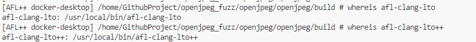
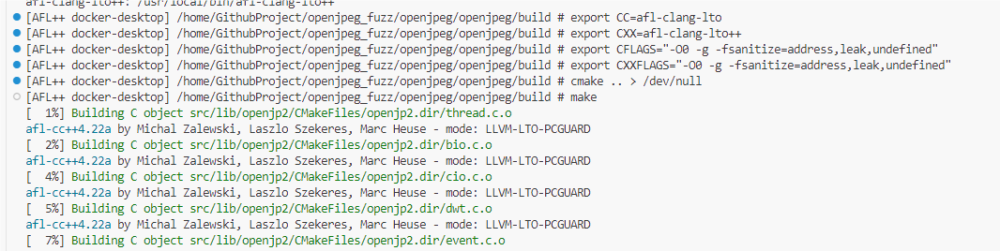
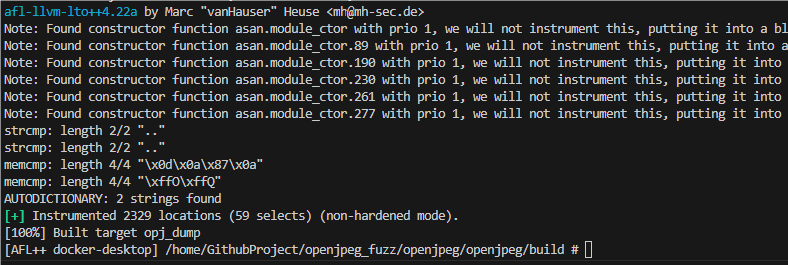
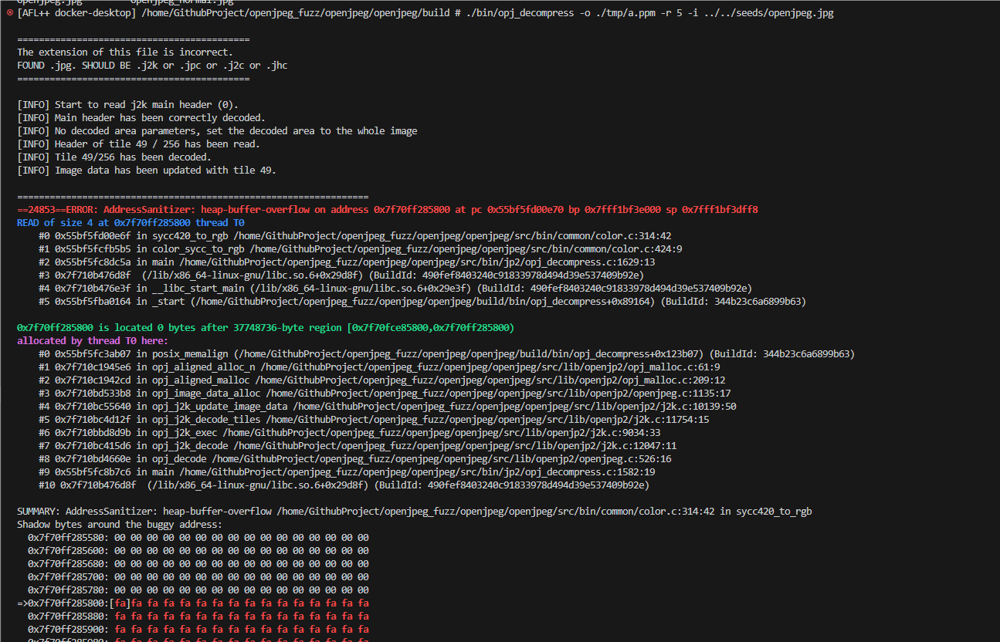
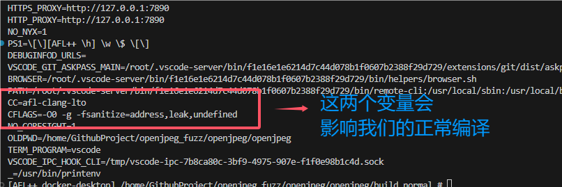
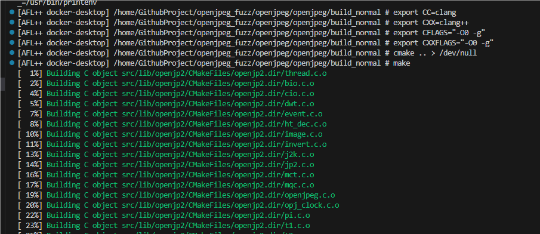
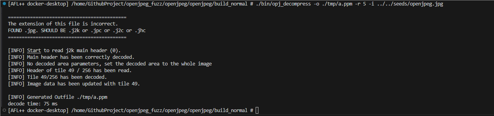

## Fuzzing Compilation and Testing with OpenJPEG

相关来源：[heap-buffer-overflow /openjpeg/src/bin/common/color.c:314 in sycc420_to_rgb() · Issue #1454 · uclouvain/openjpeg (github.com)](https://github.com/uclouvain/openjpeg/issues/1454)

### 插桩编译

在使用 AFL++ 进行 fuzzing 时，我们首先需要对程序进行插桩编译。以下是步骤：





插桩编译完成：



### 测试插桩编译

通过以下命令测试插桩编译后的程序：

```bash
[AFL++ docker-desktop] /home/GithubProject/openjpeg_fuzz/openjpeg/openjpeg/build # ./bin/opj_decompress -o ./tmp/a.ppm -r 5 -i ../../seeds/openjpeg.jpg
```

测试结果表明，成功复现了 CVE，程序发生崩溃：



### 正常编译不插桩

为了进行漏洞复现准备，我们需要进行正常编译且不插桩。首先查看环境变量，以避免编译时报错：

```bash
[AFL++ docker-desktop] /home/GithubProject/openjpeg_fuzz/openjpeg/openjpeg/build_normal # printenv
```



#### 手动解决环境变量问题

1. 新开一个终端，环境变量被清空
2. 重新导入环境变量覆盖现有的环境变量：

```bash
export CC=clang
export CXX=clang++

# 设置编译标志
export CFLAGS="-O0 -g"
export CXXFLAGS="-O0 -g"
```



### 测试正常编译

通过以下命令测试正常编译后的程序：

```bash
[AFL++ docker-desktop] /home/GithubProject/openjpeg_fuzz/openjpeg/openjpeg/build_normal # mkdir tmp
[AFL++ docker-desktop] /home/GithubProject/openjpeg_fuzz/openjpeg/openjpeg/build_normal # ./bin/opj_decompress -o ./tmp/a.ppm -r 5 -i ../../seeds/openjpeg.jpg
```

结果显示，程序正常运行，没有发生崩溃：



### 总结

通过以上步骤，我们成功完成了对 OpenJPEG 的插桩编译、测试，并复现了 CVE。随后进行了不插桩的正常编译，确认程序在 ASan 模式下正常运行，不发生崩溃。